# Complete Project Explanation: File System Simulator (C Version)

> This document explains **everything** about the C version of this project as if you know nothing about it. Read this top to bottom and you'll understand every file, every folder, and exactly what happens when you run it.

---

## What Is This Project?

This project **pretends to be a hard disk and a file system**, written entirely in the **C programming language**. Just like your Windows computer has a C: drive with folders and files, this project creates a **fake disk** (a 10 MB binary file) and lets you create folders and files inside it using a terminal.

The magic is: you can **crash** this fake disk (simulate a power failure), and then **recover** your files — demonstrating how real operating systems like Windows (NTFS) and Linux (ext4) protect your data.

**Why C?** C is the language that real operating systems (Linux, Windows NT) are written in. By implementing this in C, we work at the lowest possible level — directly managing memory, files, and binary data with no interpreter or garbage collector.

---

## Project Folder Structure

Here is everything inside `c:\Ashwell\Project\OS Project\c_fs\`:

```
c:\Ashwell\Project\OS Project\c_fs\
|
|-- disk.h / disk.c            <-- The fake hard disk (block I/O + LRU cache)
|-- bitmap.h / bitmap.c        <-- Tracks which blocks are free/used
|-- inode.h / inode.c          <-- File metadata (name, size, location on disk)
|-- directory.h / directory.c  <-- Folder tree structure
|-- recovery.h / recovery.c    <-- Journal + checkpoint + backup (crash protection)
|-- fs.h / fs.c                <-- THE BRAIN: connects all modules together
|-- main.c                     <-- The terminal you type commands into
|-- test.c                     <-- Automated 13-step demo/test
|-- Makefile                   <-- Build instructions for GCC
|
|-- fs_sim.exe                 <-- COMPILED BINARY: the interactive simulator
|-- fs_test.exe                <-- COMPILED BINARY: the automated test runner
|
|-- c_virtual_disk.bin         <-- GENERATED: The fake 10 MB hard disk file
|-- fs_journal.bin             <-- GENERATED: Recovery journal (binary format)
|-- fs_checkpoint.bin          <-- GENERATED: Metadata snapshot for recovery
|-- backups\                   <-- GENERATED FOLDER: Full disk backup copies
|   |-- backup_20260420_183000_demo.bin
|   |-- backup_20260420_183000_demo.bin_journal.bin
|   |-- backup_20260420_183000_demo.bin_checkpoint.bin
```

---

## Part 1: SOURCE CODE FILES (.h and .c files)

In C, every module is split into two files:
- **`.h` file (Header):** The "menu" — lists what functions exist and what structs look like. Other files include this to know what's available.
- **`.c` file (Implementation):** The "kitchen" — the actual code that does the work.

### How All Files Connect

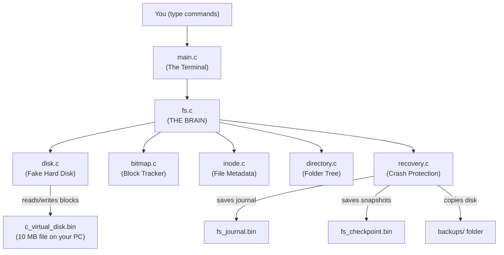

> **Key difference from Python:** In Python, objects pass data around. In C, we pass **pointers** — the memory address of the actual data. So `fs_mkdir(&fs, path)` sends the ADDRESS of the fs struct, not a copy of it.

---

## File 1: `disk.h` and `disk.c` — The Fake Hard Disk

**What it does:** Creates and manages a binary file called `c_virtual_disk.bin` on your Windows PC. This file IS the fake 10 MB disk.

**Think of it as:** A physical Hard Disk Drive (HDD) inside your computer. It stores raw bytes, knows nothing about files or folders.

### Disk Layout

The disk is carved into fixed-size **blocks** (like pages in a book):

```
c_virtual_disk.bin (10 MB = 10,485,760 bytes)
|--Block 0--|--Block 1--|--Block 2--|-- ... --|--Block 2559--|
|  4,096 B  |  4,096 B  |  4,096 B  |         |   4,096 B    |
  SUPERBLOCK  (BITMAP)    (BITMAP)      ...      (Your data)
```

| Property | Value |
|----------|-------|
| Total size | 10 MB (10,485,760 bytes) |
| Block size | 4,096 bytes (4 KB) |
| Total blocks | 2,560 |
| File path | `c_virtual_disk.bin` |

### The LRU Cache (Speed Booster)

Reading from a file is slow. So `disk.c` keeps a **cache of 64 recently-read blocks** in RAM. When you ask for block 68, it checks the cache first:

```
READ request for Block 68:
  |
  v
[Cache Check] --> FOUND? --> Return from RAM (instant, ~0ms)
                |
                NO (Cache Miss)
                |
                v
         [Read from file] --> Store in cache --> Return data
```

The cache uses **LRU (Least Recently Used)** eviction: when all 64 slots are full, the block you used longest ago gets evicted to make room for new data.

### Key Structs in `disk.h`

```c
// One slot in the 64-block cache
typedef struct {
    int      block_id;       // Which block is stored here
    uint8_t  data[4096];     // The actual 4KB block data
    int      dirty;          // 1 = modified but not saved to file yet
    long long access_time;   // Used to find the least-recently-used slot
    int      valid;          // 1 = this slot has real data
} CacheEntry;

// The entire virtual disk
typedef struct {
    char        path[256];      // "c_virtual_disk.bin"
    FILE       *fp;             // The actual file handle
    int         crashed;        // 1 = simulating a power failure
    CacheEntry  cache[64];      // Our 64-block speed cache
    DiskMetrics metrics;        // Performance counters
} VirtualDisk;
```

### Key Functions

| Function | What it does |
|----------|-------------|
| `disk_open()` | Opens `c_virtual_disk.bin` (creates it if it doesn't exist) |
| `disk_format()` | Wipes the entire 10 MB file with zeros |
| `disk_read_block(d, 68, buf)` | Reads 4 KB from block 68 into `buf` |
| `disk_write_block(d, 68, buf)` | Writes 4 KB from `buf` to block 68 |
| `disk_flush()` | Writes all dirty cache blocks to the file |
| `disk_simulate_power_loss()` | **Discards all dirty cache data. Sets crashed=1.** |

---

## File 2: `bitmap.h` and `bitmap.c` — Block Tracker

**What it does:** Uses a **bitmap** (an array of 1s and 0s) to track which disk blocks are FREE and which are USED.

**Think of it as:** A parking lot map. Each parking spot (block) is either empty (0) or taken (1).

### How the Bitmap Works

```
Block number:  0    1    2    3    4  ...  68   69   70  ...
Bit value:     1    1    1    1    1  ...   0    0    0  ...
               ^- USED (reserved  ^- FREE (available for your data)
                   system blocks)
```

A single bit represents each of the 2,560 blocks. This requires only `2560 / 8 = 320 bytes` of storage — extremely efficient!

**Blocks 0-67 (68 blocks) are permanently USED** — they store the Superblock, Bitmap, and Inode Table. Only blocks 68-2559 are available for your data files.

### Key Struct

```c
typedef struct {
    uint8_t bits[320];   // 320 bytes = 2560 bits = one bit per block
    int     total;       // = 2560 total blocks
    int     used;        // How many are currently in use
} Bitmap;
```

### Key Functions

| Function | What it does |
|----------|-------------|
| `bitmap_allocate(bm, out, 3)` | Finds 3 free blocks and marks them used. Returns their block numbers. |
| `bitmap_free(bm, blocks, 3)` | Marks 3 blocks as free again (when a file is deleted) |
| `bitmap_utilization(bm)` | Returns `used / total * 100` — the disk is X% full |

---

## File 3: `inode.h` and `inode.c` — File Metadata

**What it does:** Every file and folder gets an **inode** (index node). An inode does NOT store the file's content — it stores **information ABOUT the file**.

**Think of it as:** A sticky note that says *"File #5 is named by its parent directory, it is 77 bytes long, and its data lives in block #68 on the disk."*

### What Each Inode Stores

```c
typedef struct {
    int32_t  inode_id;              // Unique number: 0, 1, 2, 3...
    int32_t  file_type;             // 0=FILE, 1=DIRECTORY
    int32_t  access_method;         // 0=SEQUENTIAL, 1=DIRECT, 2=INDEXED
    int32_t  size;                  // File size in bytes
    double   created_at;            // Creation timestamp
    double   modified_at;           // Last modification timestamp
    int32_t  block_count;           // How many blocks this file uses
    int32_t  index_block;           // For INDEXED method: the index block ID
    int32_t  is_valid;              // 1=in use, 0=deleted
    int32_t  block_pointers[48];    // Block IDs where data is stored
    uint8_t  _pad[20];              // Padding to make struct exactly 256 bytes
} Inode;                            // TOTAL: exactly 256 bytes = 1/16th of a block
```

> **Why exactly 256 bytes?** Because a 4 KB block = 4096 bytes. 4096 / 256 = **16 inodes per block**. This means the inode table (64 blocks) can store 16 × 64 = **1,024 inodes maximum**.

### Three Access Methods

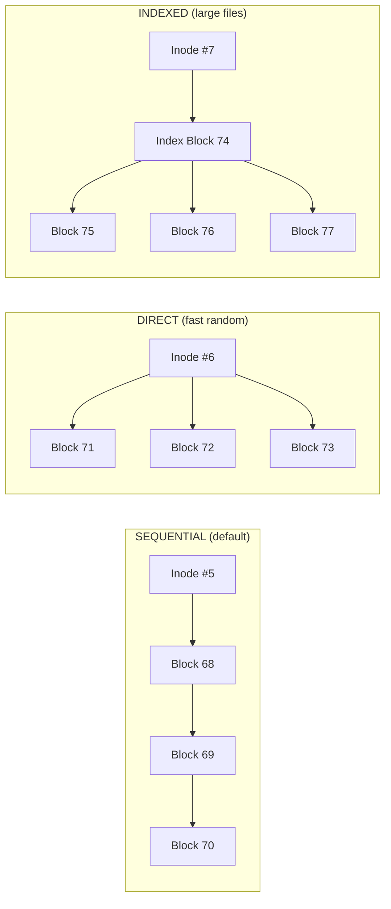

| Method | How Data Is Found | Best For |
|--------|------------------|----------|
| **SEQUENTIAL** | Read blocks in order, like reading a book page by page | Log files, audio streams |
| **DIRECT** | Inode directly points to each block (up to 48 blocks = 192 KB) | Small/medium files |
| **INDEXED** | Inode points to an INDEX block; the index block lists the actual data blocks | Large files (like UNIX ext4) |

### Inode Table on Disk

Inodes live in **blocks 4 through 67** of the virtual disk:

```
Block 4:  [Inode 0][Inode 1][Inode 2]...[Inode 15]   <- 16 inodes x 256 bytes = 4096 bytes
Block 5:  [Inode 16][Inode 17]...[Inode 31]
...
Block 67: [Inode 1008]...[Inode 1023]
```

---

## File 4: `directory.h` and `directory.c` — Folder Tree

**What it does:** Creates the folder hierarchy you know from Windows Explorer. Maps names like `/ashwell/docs/notes.txt` to inode numbers.

**Think of it as:** The folder structure you see in File Explorer — but stored as a flat table in memory.

### Internal Structure

In C, we can't use Python dictionaries. Instead we use a flat array of **DirNode** structs:

```c
// One entry inside a folder (a child file or subfolder)
typedef struct {
    char name[128];   // e.g., "notes.txt"
    int  inode_id;    // e.g., 5
    int  is_dir;      // 1=folder, 0=file
    int  is_valid;    // 1=exists, 0=deleted
} DirEntry;

// Represents one directory (a folder)
typedef struct {
    int      dir_inode;              // Which inode does THIS folder have
    DirEntry entries[64];            // Up to 64 children (files/subfolders)
    int      entry_count;            // How many children currently exist
    int      is_valid;               // 1=in use
} DirNode;

// The entire directory tree
typedef struct {
    DirNode nodes[256];   // Up to 256 simultaneous directories
    int     node_count;
} DirTree;
```

### How a Path is Resolved

When you type `read /ashwell/docs/notes.txt`, here is what `dir_resolve_path()` does step by step:

```
Path: "/ashwell/docs/notes.txt"

Step 1: Start at inode 0 (root directory "/")
Step 2: Look through root's entries for "ashwell" -> Found! inode_id = 1
Step 3: Look through inode 1's entries for "docs"  -> Found! inode_id = 2
Step 4: Look through inode 2's entries for "notes.txt" -> Found! inode_id = 5

Result: inode_id = 5
```

### Tree Visualization

When you type `tree`:

```
/
`-- [DIR] ashwell  (inode 1)
    `-- [DIR] docs  (inode 2)
        `-- [FILE] notes.txt  (inode 5)
        `-- [FILE] report.csv  (inode 6)
    `-- [DIR] images  (inode 3)
        `-- [FILE] logo.dat  (inode 7)
```

### Key Functions

| Function | What It Does |
|----------|-------------|
| `dir_init(t)` | Creates the root directory (inode 0) |
| `dir_mkdir(t, 0, "ashwell", 1)` | Creates folder "ashwell" under root (inode 0), assigns it inode 1 |
| `dir_create_file(t, 2, "notes.txt", 5)` | Creates file "notes.txt" under folder inode 2, assigns inode 5 |
| `dir_resolve_path(t, "/ashwell/docs")` | Converts path → inode number |
| `dir_resolve_parent(t, "/ashwell/docs/notes.txt", name)` | Gets parent inode (2) and child name ("notes.txt") |
| `dir_delete_entry(t, 2, "notes.txt")` | Removes the file entry from the folder |
| `dir_search(t, "notes.txt", results, 10)` | Searches all folders for a file by name |

---

## File 5: `recovery.h` and `recovery.c` — Crash Protection

**What it does:** Three layers of protection so no data is permanently lost when a crash occurs.

**Think of it as:** An insurance policy for your fake hard drive.

### Layer 1: Write-Ahead Journal (`fs_journal.bin`)

Before ANY operation touches the disk, a log entry is written first. This is called "Write-Ahead Logging" (WAL) — the same technique used by PostgreSQL, SQLite, and Linux ext4.


- **Crash between steps 1 and 2:** Nothing was written. Journal says "uncommitted" → recovery knows to redo it.
- **Crash between steps 2 and 3:** Partial write happened. Journal says "uncommitted" → recovery rolls it back or completes it.
- **No crash:** Journal says "committed" → everything is fine.

### Journal Entry Struct

```c
typedef struct {
    int32_t txn_id;                // Unique transaction number: 1, 2, 3...
    char    op_type[32];           // "MKDIR", "CREATE_FILE", "WRITE_FILE"...
    char    path[512];             // "/ashwell/docs/notes.txt"
    int32_t inode_id;              // Which inode was involved
    int32_t parent_inode;          // Parent folder's inode
    int32_t blocks[48];            // Which disk blocks were allocated
    int32_t block_count;           // How many blocks
    int32_t size;                  // File size written
    int32_t committed;             // 0 = in progress, 1 = DONE
    int32_t is_valid;              // 1 = this entry is real
} JournalEntry;
```

### Layer 2: Checkpoint (`fs_checkpoint.bin`)

Every time you create a folder, write a file, or type `checkpoint`, the system takes a **complete binary snapshot** of the entire file system metadata:

```
fs_checkpoint.bin contains:
  +------------------+
  | magic: 0xC5EC    |   <- Verification number to detect corruption
  | next_inode_id    |   <- Next free inode number
  | inode_count      |   <- How many inodes are used
  | inodes[1024]     |   <- ALL 1024 inode records (256 bytes each = 256 KB)
  | dir_tree         |   <- The ENTIRE directory tree (~2.2 MB)
  +------------------+
```

When `recover` is called, this file is loaded back into memory — instantly restoring all folder structures and file metadata.

### Layer 3: Backup (`backups/` folder)

Typing `backup demo` creates 3 files with a timestamp:

```
backups/
  backup_20260420_183000_demo.bin             <- Full copy of c_virtual_disk.bin (10 MB)
  backup_20260420_183000_demo.bin_journal.bin <- Copy of journal
  backup_20260420_183000_demo.bin_checkpoint.bin <- Copy of checkpoint
```

Typing `restore backup_20260420_183000_demo.bin` copies all 3 back, effectively time-traveling your entire file system.

---

## File 6: `fs.h` and `fs.c` — THE BRAIN

**What it does:** The central controller that connects all other modules. When you type any command, `main.c` calls a function in `fs.c`, which then coordinates disk, bitmap, inodes, directory, and recovery to complete the operation.

**Think of it as:** The operating system kernel. It's the traffic controller of all operations.

### The Master Struct

```c
typedef struct {
    VirtualDisk  disk;              // The 10 MB fake hard disk
    Bitmap       bitmap;            // Block free/used tracker
    Inode        inodes[1024];      // All file/folder metadata
    DirTree      dir_tree;          // The folder hierarchy
    Journal      journal;           // Write-ahead log
    Checkpoint   checkpoint;        // Latest metadata snapshot
    int          next_inode_id;     // Next available inode number
    int          mounted;           // 1 = ready to use, 0 = crashed/unmounted
    double       recovery_time_ms;  // How long the last recovery took
    int          checkpoints_made;  // Total checkpoints saved
} FileSystem;
```

> **Why `static FileSystem fs;` in main.c?** This struct is approximately **5-6 MB in size** (the DirTree alone is 2.2 MB, Checkpoint contains a full copy of all inodes + dir tree). Declaring it as a local variable would try to put 6 MB on the **stack** (which Windows limits to 1 MB) and instantly crash. The `static` keyword places it in the program's global data segment instead, which has no such limit.

### The Disk Layout (How 10 MB is Organized)

```
|  Block 0   | Blocks 1-3   | Blocks 4-67       | Blocks 68-2559  |
| SUPERBLOCK |    BITMAP    |   INODE TABLE     |   DATA BLOCKS   |
|  (4 KB)    |  (12 KB)     |  (256 KB)         |  (9.98 MB)      |
|   config   | free/used?   | file/folder info  | your actual data|
```

| Region | Blocks | Size | Purpose |
|--------|--------|------|---------|
| Superblock | 0 | 4 KB | Magic number "FSIM", version, disk params |
| Bitmap | 1-3 | 12 KB | 2,560 bits (one per block) for free space |
| Inode Table | 4-67 | 256 KB | 1,024 inode records × 256 bytes each |
| Data Blocks | 68-2559 | ~9.98 MB | Where actual file content is stored |

### Auto-Checkpoint Behavior

Every time you run `mkdir`, `create`, or `write`, `fs.c` automatically calls `fs_checkpoint()` after completing the operation. This means every change is immediately backed up to `fs_checkpoint.bin`. This is why your folder tree survives even a power-loss crash!

---

## File 7: `main.c` — The Terminal Interface

**What it does:** The interactive command prompt you type into. Reads your keyboard input, parses it into command + arguments, and calls the right function in `fs.c`.

**Think of it as:** Like Windows Command Prompt (cmd.exe), but our own custom version for our fake file system.

When you run `./fs_sim.exe` you see:

```
+==============================================================+
|       File System Recovery & Optimization Simulator          |
|                  Interactive CLI  (C version)                |
+==============================================================+
Type 'help' for a list of commands.

[FS] File system mounted.
fs>
```

### Auto-Path Fix

`main.c` includes a `fix_path()` helper that automatically adds a leading `/` if you forget. So both of these work:

```
fs> mkdir ashwell       <- automatically becomes /ashwell
fs> mkdir /ashwell      <- already correct, no change
```

### Complete Command List

| Command | Example | What Happens |
|---------|---------|-------------|
| `format` | `format` | Wipes disk, creates fresh file system |
| `mkdir` | `mkdir /docs` | Creates a folder |
| `rmdir` | `rmdir /docs` | Removes an EMPTY folder |
| `ls` | `ls /docs` | Lists contents of a folder |
| `create` | `create /docs/f.txt` | Creates empty file (optional: `seq`, `dir`, `idx`) |
| `write` | `write /docs/f.txt Hello` | Writes text into a file |
| `read` | `read /docs/f.txt` | Reads and prints file content |
| `delete` | `delete /docs/f.txt` | Deletes a file |
| `rename` | `rename /docs/f.txt newname.txt` | Renames file |
| `search` | `search notes.txt` | Finds file anywhere in the tree |
| `stat` | `stat /docs/f.txt` | Shows detailed file metadata |
| `tree` | `tree` | Prints folder tree |
| `checkpoint` | `checkpoint` | Saves metadata snapshot now |
| `crash` | `crash power` | Simulates power failure |
| `recover` | `recover` | Recovers from crash |
| `backup` | `backup v1` | Creates full backup in backups/ |
| `restore` | `restore backup_...bin` | Restores a backup |
| `defrag` | `defrag` | Reorganizes files on disk |
| `metrics` | `metrics` | Shows performance statistics |
| `exit` | `exit` | Saves everything and quits |

---

## File 8: `test.c` — The Automated Demo

**What it does:** Runs 13 pre-programmed operations automatically. No typing needed. Each stage prints `[OK]` if it worked or `[FAIL]` if something broke.

**Think of it as:** A self-test. Like a hospital doing a systems check before surgery.

Run it with: `./fs_test.exe`

```
--- Stage 1: Format ---           Format the disk
--- Stage 2: Create Directories --- mkdir /documents, /documents/reports, /images
--- Stage 3: Create Files ---     Create 3 files with different access methods
--- Stage 4: Write Files ---      Write content to all 3 files
--- Stage 5: Read Back Files ---  Read and verify the content is correct
--- Stage 6: Directory Listing -- List the root directory
--- Stage 7: Search ---           Search for "readme.txt" by name
--- Stage 8: Checkpoint ---       Save a metadata snapshot
--- Stage 9: Simulate Power Loss - CRASH the disk (crash power)
--- Stage 10: Recovery ---        Run recover and verify it worked
--- Stage 11: Read After Recovery- Confirm data is still there
--- Stage 12: Backup & Restore -- Create a backup
--- Stage 13: Defragmentation --- Run defrag and verify it completes
```

---

## File 9: `Makefile` — Build Instructions

**What it does:** Tells the GCC compiler how to build the project. Instead of typing a long gcc command, you just type `make`.

**Think of it as:** A recipe for compiling the code.

| Command | What it does |
|---------|-------------|
| `make` | Compiles everything, produces `fs_sim.exe` and `fs_test.exe` |
| `make clean` | Deletes all compiled files so you can start fresh |

The GCC compile command it runs behind the scenes:

```bash
gcc -O2 -std=c11 disk.c bitmap.c inode.c directory.c recovery.c fs.c main.c -o fs_sim.exe
```

---

## Part 2: GENERATED FILES (Created When You Run The Program)

These files are NOT code. They are created automatically.

### `c_virtual_disk.bin` (10 MB)

**Location:** `c:\Ashwell\Project\OS Project\c_fs\c_virtual_disk.bin`

**What it is:** THE fake hard disk. All your simulated files live here.

When you type `write /docs/notes.txt Hello`, the text "Hello" is physically stored 4 KB × 68 = **byte offset 278,528** inside this file:

```
c_virtual_disk.bin at offset 278,528 (block 68):
  48 65 6C 6C 6F 00 00 00 00 00 ...
   H  e  l  l  o  (zeros fill rest of the 4096-byte block)
```

**You cannot read this file in Notepad** — it is raw binary.

**Created when:** You run `format`.

---

### `fs_journal.bin`

**Location:** `c:\Ashwell\Project\OS Project\c_fs\fs_journal.bin`

**What it is:** A binary log file. Every operation is written here BEFORE it executes. After it succeeds, the entry is marked "committed."

**Difference from Python version:** The Python version saved this as JSON text. Our C version saves it as a **binary struct** — much faster to write and read, but not human-readable.

**What's inside (conceptually):**

```
Entry 1: txn_id=1, op=MKDIR, path=/documents, committed=YES
Entry 2: txn_id=2, op=CREATE_FILE, path=/documents/readme.txt, committed=YES
Entry 3: txn_id=3, op=WRITE_FILE, path=/documents/readme.txt, blocks=[68], committed=YES
```

**Used when:** A crash happens. Recovery reads this file to see which operations finished.

**Created when:** First operation after `format`. Auto-truncated after each `checkpoint`.

---

### `fs_checkpoint.bin`

**Location:** `c:\Ashwell\Project\OS Project\c_fs\fs_checkpoint.bin`

**What it is:** A binary snapshot of the entire file system's METADATA (not the file data itself — just the structure: which files exist, their sizes, which blocks they use).

**Difference from Python:** Python wrote this as a JSON file (`fs_checkpoint.json`). C writes it as raw binary with `fwrite()` — it is a direct memory dump of the `Checkpoint` struct taking up approximately **2.5 MB** on disk.

**Contents:**
- Magic number `0xC5EC` (to verify the file is not corrupted)
- `next_inode_id` (next available inode number)
- All 1,024 `Inode` records (256 bytes each = 256 KB)
- The full `DirTree` (~2.2 MB)

**Created when:** Every `mkdir`, `create`, `write`, `checkpoint`, `format`, and `defrag` call.

---

### `backups/` folder

**Location:** `c:\Ashwell\Project\OS Project\c_fs\backups\`

**What it is:** A folder that stores full disk backups.

Each backup creates 3 files stamped with the current date and time:

```
backups/
  backup_20260420_183015_v1.bin             <- Full copy of c_virtual_disk.bin (10 MB)
  backup_20260420_183015_v1.bin_journal.bin <- Journal at backup time
  backup_20260420_183015_v1.bin_checkpoint.bin <- Checkpoint at backup time
```

To restore: `restore backup_20260420_183015_v1.bin`

The system finds the matching `_journal.bin` and `_checkpoint.bin` automatically by appending `_journal.bin` and `_checkpoint.bin` to the provided filename.

---

## Part 3: COMPLETE FLOW OF EVERY MAJOR OPERATION

### Flow 1: `format` — Creating a New Disk

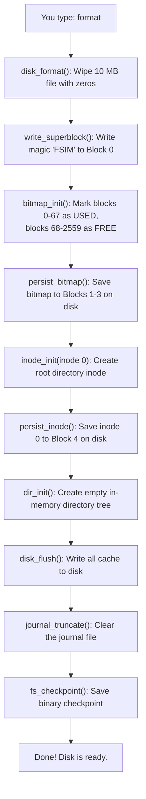

---

### Flow 2: `mkdir /docs` — Creating a Folder

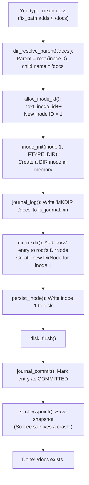

---

### Flow 3: `write /docs/notes.txt Hello World` — Writing Data

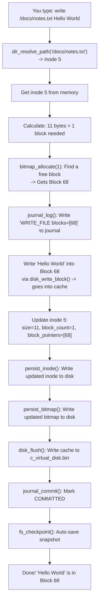

**Where is the data physically?**

```
c_virtual_disk.bin at position (68 × 4096 = 278,528 bytes from start):
  48 65 6C 6C 6F 20 57 6F 72 6C 64 00 00 00 ...
   H  e  l  l  o     W  o  r  l  d  (zeros fill the rest of the 4 KB block)
```

---

### Flow 4: `read /docs/notes.txt` — Reading Data

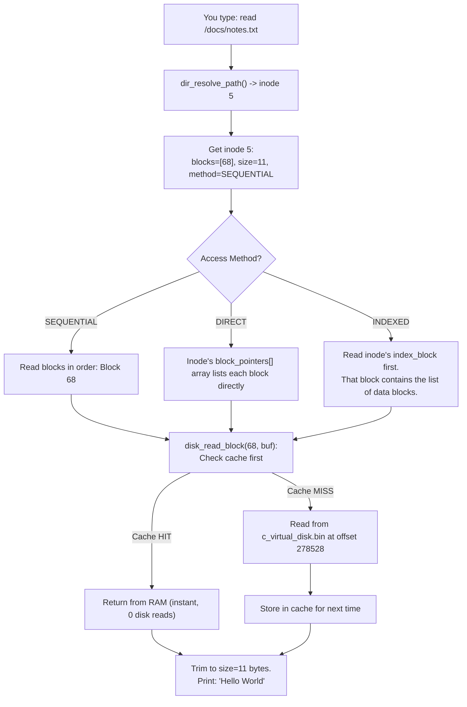

---

### Flow 5: `crash power` — Power Loss Simulation

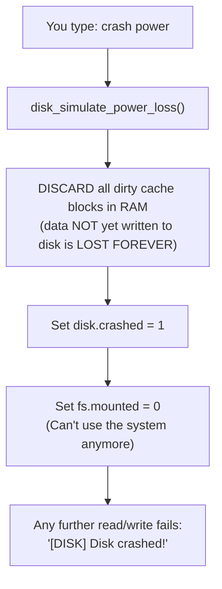

**What gets LOST:**
- Any block written to the LRU cache but NOT yet flushed to disk

**What SURVIVES:**
- Everything already written to `c_virtual_disk.bin`
- `fs_checkpoint.bin` (a separate file, untouched by the crash)
- `fs_journal.bin` (a separate file, untouched by the crash)

> **Why does the tree survive in our demo?** Because we auto-checkpoint after EVERY `mkdir`, `create`, and `write`. By the time a crash happens, the latest checkpoint already has your folder tree. This is similar to how SSDs with power-loss protection work.

---

### Flow 6: `recover` — Crash Recovery

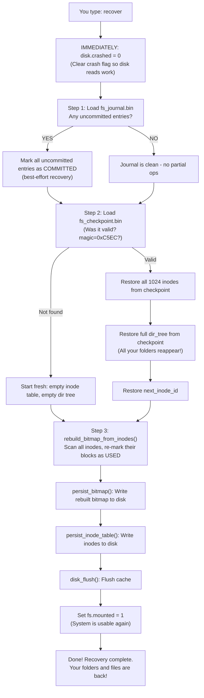

---

### Flow 7: `backup v1` and `restore` — Full Disk Backup

**Creating a backup:**

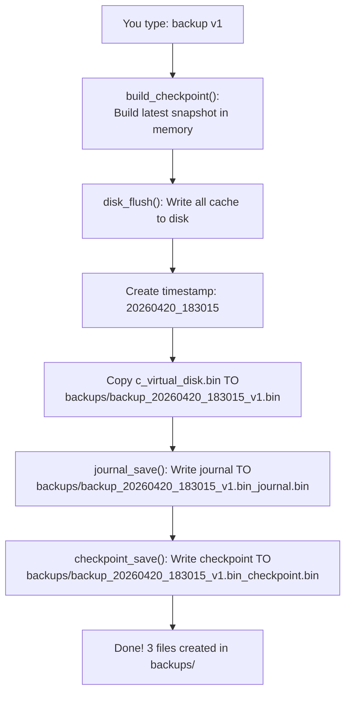

**Restoring a backup:**

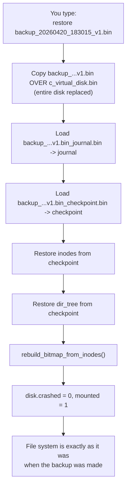

---

### Flow 8: `defrag` — Disk Defragmentation

Over time, as files are created, written, and deleted, data blocks become **scattered** across the disk (fragmented). Defrag packs them back together.

**Before defrag (fragmented):**

```
Block:  68    69    70    71    72    73    74    75
Data: [A-p1][FREE][B-p1][A-p2][FREE][B-p2][A-p3][FREE]

File A is FRAGMENTED: blocks 68, 71, 74 (scattered!)
File B is FRAGMENTED: blocks 70, 73 (scattered!)
```

**After defrag (contiguous):**

```
Block:  68    69    70    71    72    73    74    75
Data: [A-p1][A-p2][A-p3][B-p1][B-p2][FREE][FREE][FREE]

File A: blocks 68, 69, 70 (one continuous run, faster reads!)
File B: blocks 71, 72 (together!)
```

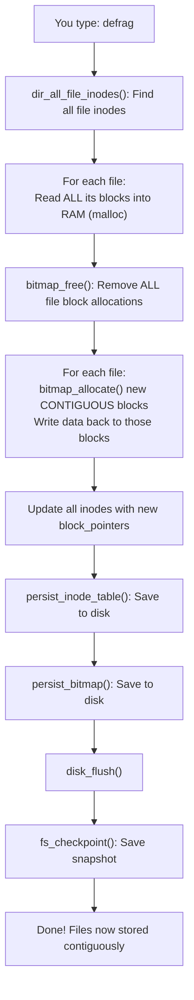

---

## Part 4: HOW TO RUN THIS FROM SCRATCH

### Step 1: Set Up GCC (One-Time Only)

GCC comes from MSYS2, which was already installed. Add it to your PATH:

```powershell
$env:PATH = "C:\msys64\mingw64\bin;" + $env:PATH
```

### Step 2: Navigate to the C Project Folder

```powershell
cd "c:\Ashwell\Project\OS Project\c_fs"
```

### Step 3: Compile (if not already compiled)

```powershell
gcc -O2 -std=c11 disk.c bitmap.c inode.c directory.c recovery.c fs.c main.c -o fs_sim.exe
```

Or to also compile the test:

```powershell
gcc -O2 -std=c11 disk.c bitmap.c inode.c directory.c recovery.c fs.c test.c -o fs_test.exe
```

### Step 4: Run the Simulator

```powershell
.\fs_sim.exe
```

### Step 5: Type Commands in This Order

```
fs> format                              <- Create the virtual disk

fs> mkdir ashwell                       <- Create a folder
fs> mkdir ashwell/docs                  <- Create a subfolder
fs> create ashwell/docs/hello.txt       <- Create an empty file
fs> write ashwell/docs/hello.txt Hi!   <- Write text into the file
fs> read ashwell/docs/hello.txt         <- Read it back: Hi!
fs> tree                                <- See folder structure

fs> metrics                             <- Performance stats

fs> crash power                         <- SIMULATE POWER LOSS!
fs> recover                             <- RECOVER FROM CRASH!
fs> read ashwell/docs/hello.txt         <- Data is still there!

fs> backup v1                           <- Create a backup
fs> delete ashwell/docs/hello.txt       <- Delete the file
fs> restore backup_..._v1.bin          <- Restore from backup
fs> tree                                <- File is back!

fs> defrag                              <- Defragment the disk
fs> exit                                <- Save and quit
```

### Step 6: OR Run the Automated Test

```powershell
.\fs_test.exe
```

All 13 stages run automatically. If all pass you see:

```
+===================================================+
|  ALL 13 STAGES PASSED - C File System Simulator   |
+===================================================+
```

---

## Part 5: What Makes the C Version Different from Python?

| Feature | Python Version | C Version |
|---------|---------------|-----------|
| **Language** | Python 3 (interpreted) | C11 (compiled to machine code) |
| **Classes** | `class FileSystem:` | `typedef struct FileSystem` |
| **Methods** | `fs.mkdir('/docs')` | `fs_mkdir(&fs, "/docs")` |
| **Memory** | Automatic garbage collection | Manual: `malloc()` / `free()` |
| **Checkpoint** | JSON file (human readable) | Binary struct dump (much faster) |
| **Journal** | JSON text lines | Binary JournalEntry structs |
| **Directory** | Python dict of lists | Fixed-size array of DirNode structs |
| **LRU Cache** | `OrderedDict` | Timestamp-based eviction array |
| **Speed** | ~10x slower (interpreted) | Native machine code, near hardware speed |
| **Stack issue** | No stack limit | FileSystem (5 MB) must be `static` |
| **Start command** | `python cli.py` | `.\fs_sim.exe` |

---

## Part 6: Complete Data Flow (Everything at Once)

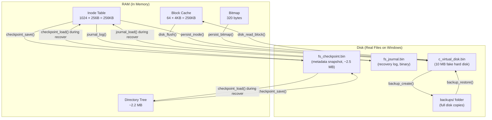

---

## Summary Table: Every File at a Glance

| File | Type | Size | Purpose | Created When |
|------|------|------|---------|-------------|
| `disk.h / disk.c` | Source code | ~15 KB | Virtual disk, LRU cache, crash injection | You wrote it |
| `bitmap.h / bitmap.c` | Source code | ~6 KB | Block free/used tracker (320-byte bitmap) | You wrote it |
| `inode.h / inode.c` | Source code | ~7 KB | File metadata (256 bytes/inode, exactly) | You wrote it |
| `directory.h / directory.c` | Source code | ~12 KB | Folder tree (DirTree / DirNode / DirEntry) | You wrote it |
| `recovery.h / recovery.c` | Source code | ~10 KB | Journal, checkpoint, backup/restore logic | You wrote it |
| `fs.h / fs.c` | Source code | ~25 KB | Central controller: connects all modules | You wrote it |
| `main.c` | Source code | ~9 KB | Interactive CLI with auto-path fix | You wrote it |
| `test.c` | Source code | ~8 KB | Automated 13-stage test suite | You wrote it |
| `Makefile` | Build script | ~1 KB | Compile instructions for GCC | You wrote it |
| `fs_sim.exe` | Binary | ~300 KB | The compiled interactive simulator | `gcc` compile step |
| `fs_test.exe` | Binary | ~300 KB | The compiled automated test | `gcc` compile step |
| `c_virtual_disk.bin` | Binary | **10 MB** | THE fake hard disk - all your data | `format` command |
| `fs_journal.bin` | Binary | ~200 KB | Write-ahead log for crash recovery | First operation |
| `fs_checkpoint.bin` | Binary | ~2.5 MB | Full metadata snapshot | Every mkdir/write/create |
| `backups/` | Folder | ~10 MB each | Full disk + journal + checkpoint copies | `backup` command |
