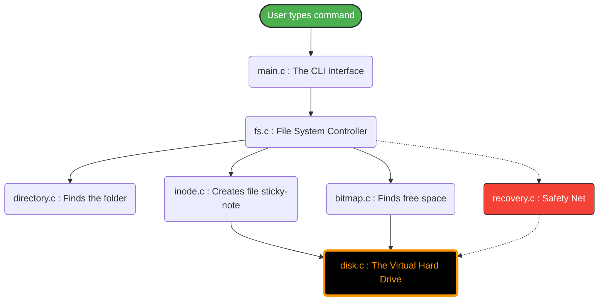

# The C File System Simulator: A Beginner's Guide

Welcome! This document will explain exactly what this project is, how it works, and what happens behind the scenes when you use it. We will assume you have zero prior knowledge of Operating Systems.

---

## 1. What is this project?

When you save a file on your computer, the Operating System translates that file into raw 1s and 0s and saves it onto a physical Hard Drive. 

This project **simulates** that exact process. Instead of managing a real physical hard drive, we manage a single hidden file on your computer (`c_virtual_disk.bin`) and pretend it is a 10 Megabyte hard drive. We built our own miniature Operating System to format it, create folders, save data, and recover from power outages.

---

## 2. How to Run It

To start the simulator, open your terminal (PowerShell or MSYS2), enter the project folder, and run:

```bash
cd "c:\Ashwell\Project\OS Project\c_fs"
./fs_sim.exe
```

When you see the `fs>` prompt, you are inside the simulator! 
- *First time?* Type `format` to initialize the pretend hard drive.
- Type `help` to see all what you can do.

---

## 3. The Architecture (Flow of Data)

When you type a command like `write /docs/hello.txt`, here is how the data flows from top to bottom through our C files:



---

## 4. What does every file do?

Here is the plain-English dictionary of our source code:

### The Interface
*   📁 **`main.c`**: The "Front Door". It listens to what you type on the keyboard, understands the command (like `mkdir` or `read`), and tells the rest of the system what to do.

### The Brain
*   📁 **`fs.c` / `fs.h`**: The "Manager". It connects all the pieces together. If `main.c` says "Delete a file", `fs.c` gathers the directory list, finds the file, frees the space, and updates the hard drive. 

### The Components
*   📁 **`directory.c` / `directory.h`**: The "Map". It ensures folders can go inside folders (like `/ashwell/docs`). It keeps a list of file names so you can find them later.
*   📁 **`inode.c` / `inode.h`**: The "Sticky Notes". The computer doesn't know what "notes.txt" is. It only knows ID numbers. An Inode is a digital sticky note that says *"File #3 has 500 bytes and belongs to the folder 'docs'"*.
*   📁 **`bitmap.c` / `bitmap.h`**: The "Parking Attendant". Imagine the hard drive is a parking lot. The bitmap keeps track of which parking spots (blocks) are empty and which ones have cars (data) in them.

### The Hardware Simulation
*   📁 **`disk.c` / `disk.h`**: The "Pretend Hard Drive". It intercepts all the 1s and 0s from the system above and physically saves them into a file on your actual Windows computer. It also simulates hardware crashes.

### The Safety Net
*   📁 **`recovery.c` / `recovery.h`**: The "Insurance Policy". If the power goes out, this code reads emergency backups and fixes broken files.

---

## 5. What happens during a Crash?

Imagine you are saving an image, and halfway through, the power goes out. Half the image is written, half is gone. Your hard drive is corrupted.

If you type `crash power` in our simulator:
1. The **`disk.c`** file forces the system to stop dead in its tracks. All unsaved memory is instantly deleted (simulating pulling the plug).
2. The virtual hard drive is marked as `CRASHED`. 
3. If you try to `read` or `write` anything, the system will yell at you.

**The Recovery Journey:**
When you type `recover`:
1. The **`fs.c`** controller notices you want to fix things.
2. It asks **`recovery.c`** to look for the last "Checkpoint".
3. **What is a Checkpoint?** Every time you make a folder or write a file, the system takes an instant "photo" of the folder tree and saves it to a special emergency file (`fs_checkpoint.bin`).
4. `recovery.c` finds the emergency photo, loads it back into memory, and magically, your folders and files are back exactly as they were 1 millisecond before the power went out.
5. The `CRASHED` warning is lifted, and you can use the system again!

---

## 6. Where is the Data Actually Stored?

If you look in the `c_fs/` folder on your Windows machine, you will notice a few mysterious `.bin` (Binary) files. If you open them in Notepad, they will look like gibberish. That is your data!

| Background File | What is it? |
| :--- | :--- |
| 💾 **`c_virtual_disk.bin`** | **The Main Hard Drive.** This is exactly 10 Megabytes. When you type `write ashwell/notes.txt Hello`, the word "Hello" is secretly written inside this file. |
| 📸 **`fs_checkpoint.bin`** | **The Rescue Photo.** The auto-save file used by the system to fix itself when you type `recover`. |
| 📝 **`fs_journal.bin`** | **The To-Do List.** A smaller file that tracks actions currently in progress (used for advanced recovery). |

### What about Backups?
If you type `backup First_Version` in the simulator, the system creates a folder called `backups/` inside the `c_fs` directory.
Inside `backups/`, it makes a **perfect clone** of your `c_virtual_disk.bin` and names it something like: `backup_20260420_183000_First_Version.bin`.

If you ever ruin your file system, you can just type:
`restore backup_20260420_183000_First_Version.bin` 
...and your whole virtual world goes back in time!
